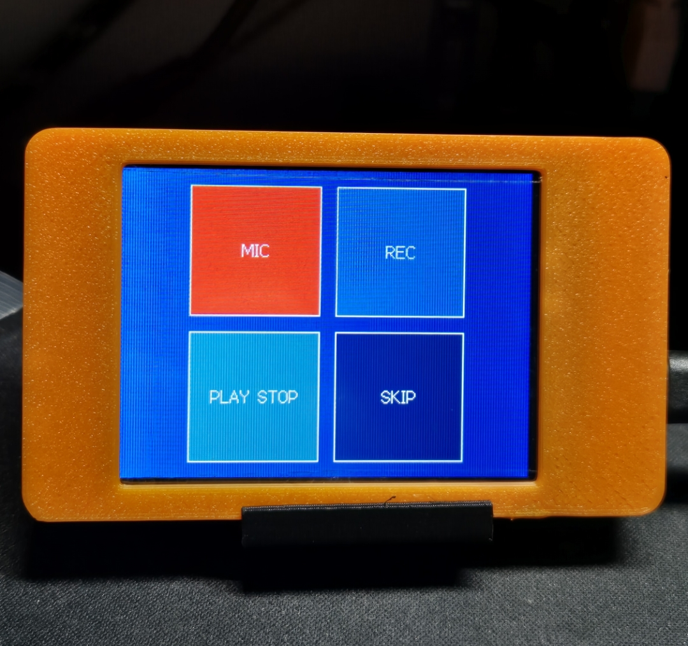
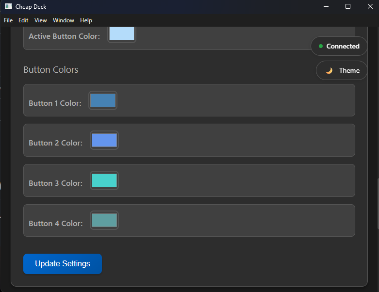

# 🎮 CheapDeck - DIY Stream Deck Alternative

A complete **DIY Stream Deck alternative** built with **ESP32**, featuring a **touchscreen interface**, customizable buttons, and PC integration.

| Pierwszy | Drugi |
|----------|-------|
|  |  |
---

## 🔍 Overview

CheapDeck consists of:

- **ESP32 Hardware** – Touch-enabled button interface (2x2 or 3x2 layout)  
- **Python API** – Background service for key mapping and system integration  
- **Desktop App** – Electron-based configuration interface  
- **Web Interface** – Browser-based control panel  

---

## ✨ Features

- 📱 **Touch Interface** – Responsive touchscreen with customizable layouts  
- 🎹 **Key Mapping** – Configurable assignments (F-keys, media keys, combinations)  
- 🔎 **Auto-Discovery** – Automatic ESP32 device detection  
- 🎨 **Color Customization** – Individual button colors and themes  
- 🖥 **Info Mode** – System information display (time, CPU, RAM)  
- 🔋 **Power Management** – Deep sleep and configurable timeouts  

---

## 🔧 Hardware Requirements

### ESP32 Setup
- ESP32 development board  
- TFT display with `TFT_eSPI` support  
- `XPT2046` touch controller  

### PC Requirements
- Python **3.8+**  
- Node.js **16+** (for desktop app)  
- WiFi connection  

---

## 🚀 Quick Installation

### 1. ESP32 Firmware

#### 🔹 Option A: Web Flasher (Recommended, No IDE Needed)
1. Open the [CheapDeck Web Flasher](https://hdmain.github.io/CheapDeck_Webflasher) in **Google Chrome** or **Microsoft Edge**  
2. Plug in your ESP32 via USB  
3. Click **Connect**, select the COM port, then **Install**  
4. Enter your WiFi SSID & Password when prompted  
5. The ESP32 will reboot and connect to your WiFi automatically
